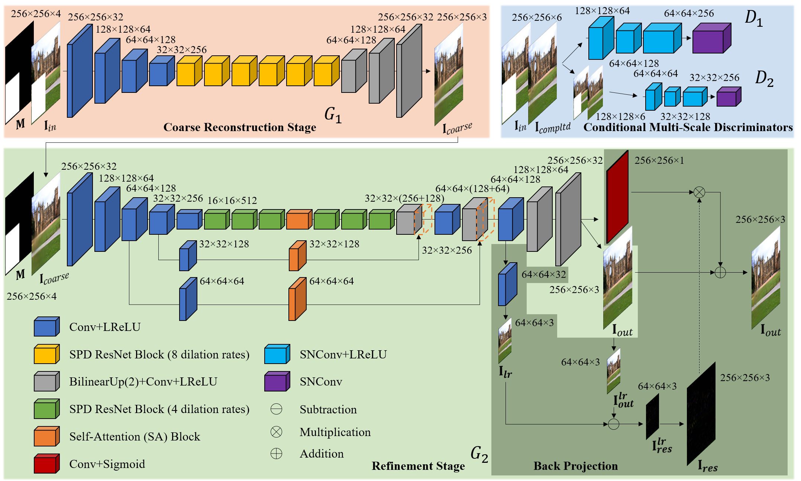
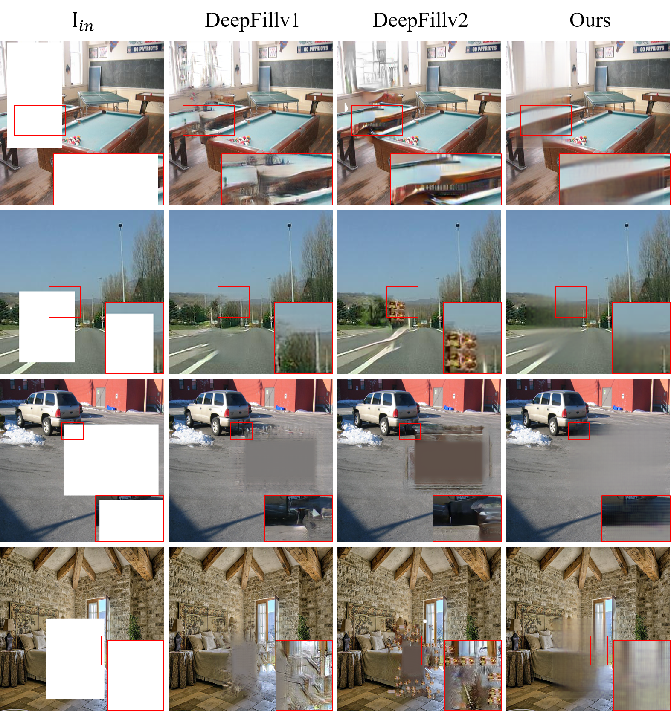
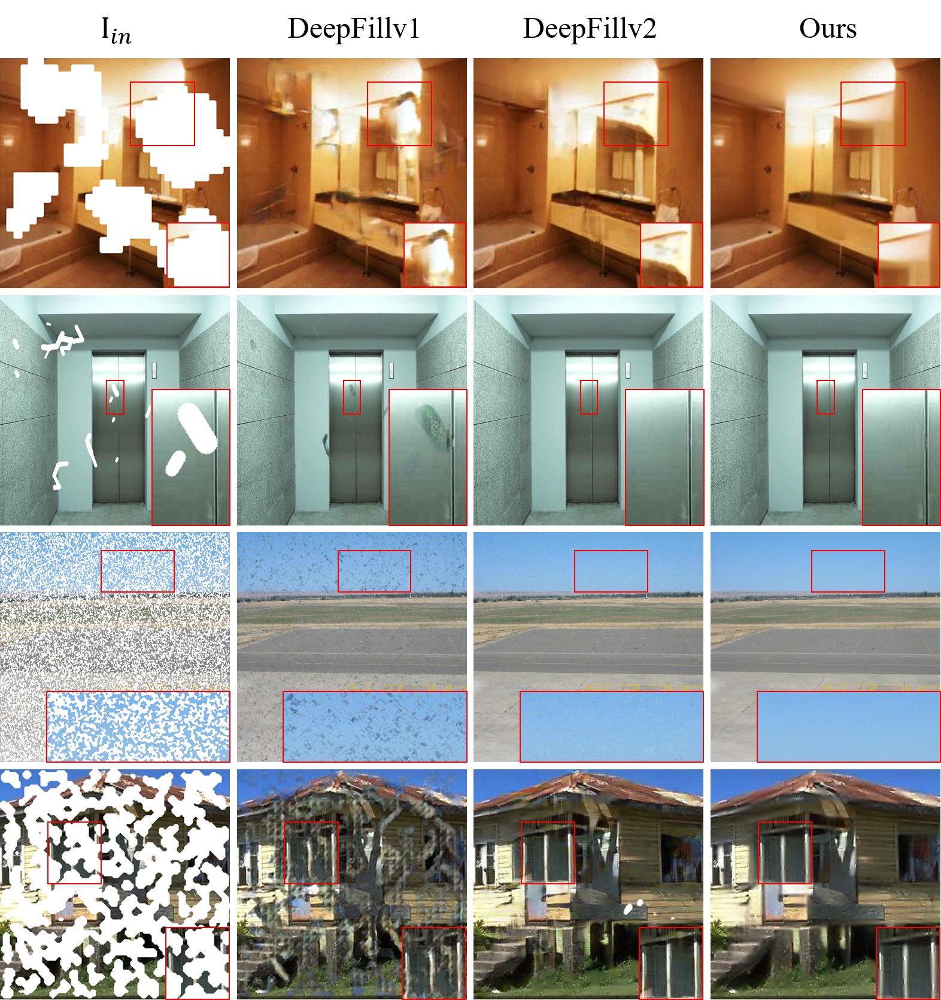

# Deep Generative Inpainting Network (DeepGIN) for Extreme Image Inpainting 
For AIM2020 ECCV Extreme Image Inpainting Challenge (both Track 1 Classic and Track 2 Semantic Guidance)   
This is the Pytorch implementation of DeepGIN for Extreme Image Inpainting. We have participated in AIM 2020 ECCV Extreme Image Inpainting Challenge. DeepGIN is used for reconstructing a completed image from a randomly masked image with both satisfactory visual quality and pixel-wise reconstruction accuracy.    

For more information about the challenge, please visit the github project page provided by the organizers [here](https://github.com/vglsd/AIM2020-Image-Inpainting-Challenge). Thank you very much!!

## Let's Start!
- For Track 1 Classic Inpainting, please click [here](https://github.com/rlct1/gin) (our project link to track 1)
- For Track 2 Inpainting with Semantic Guidance, please click [here](https://github.com/rlct1/gin-sg) (our project link to track 2)

## Overview

  
  

## Qualitative Comparisons of test results on the AIM Challenge test set (Rectangular masks)

  
  

- Each row shows an example of the test results. From left to right: the first column shows different input masked images. The second to the fourth columns display the completed images by DeepFillv1, DeepFillv2, and our DeepGIN. Note that the ground truth images are not provided for self evaluation, hence only qualitative comparisons can be reported here. Please zoom in for a better view. If you are interested in the quantitative comparisons, you may search for the challenge report. 

## Qualitative Comparisons of test results on the AIM Challenge test set (Irregular masks)

  
  

- Again, each row shows an example of the test results. From left to right: the first column shows different input masked images. The second to the fourth columns display the completed images by DeepFillv1, DeepFillv2, and our DeepGIN. Note that the ground truth images are not provided for self evaluation, hence only qualitative comparisons can be reported here. Please zoom in for a better view to see the details and textures. For example, see the textures of the sky in the third row. If you are interested in the quantitative comparisons, you may search for the challenge report. 

## Acknowledgment 
- Thank you for visiting this project page
- Our code is developed based on the skeleton of the Pytorch implementation of [pix2pixHD](https://github.com/NVIDIA/pix2pixHD)
